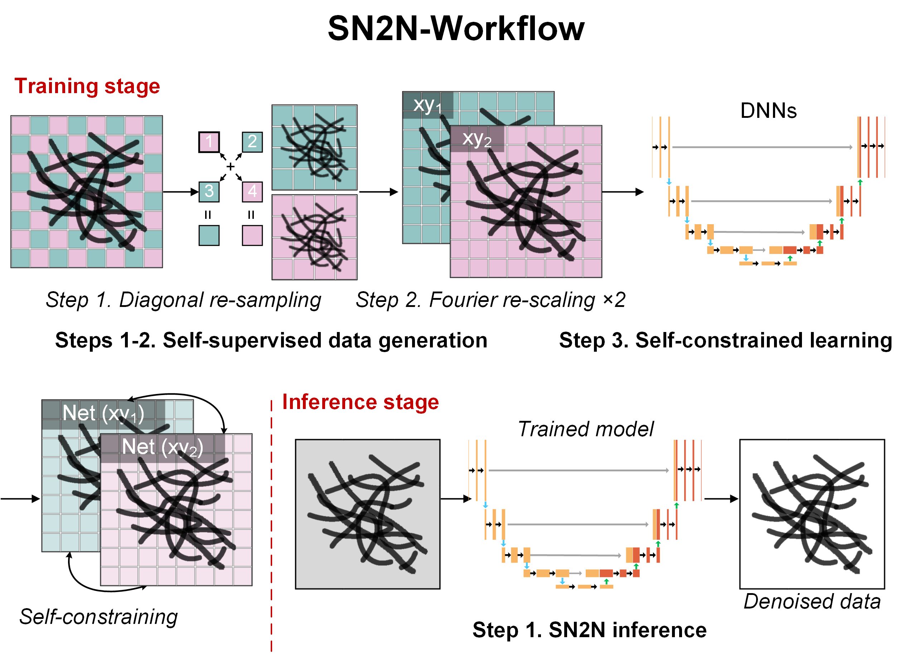

[](https://github.com/WeisongZhao/SN2N/)
[](https://github.com/WeisongZhao/SN2N/releases/tag/v0.3.2/)
[](https://github.com/WeisongZhao/SN2N/blob/master/LICENSE/)
[](https://www.nature.com/articles/s41592-024-02400-9/)
[](https://github.com/WeisongZhao/SN2N/releases/tag/v0.3.5/)
<br>

[](https://twitter.com/QuLiying)
[](https://twitter.com/weisong_zhao)
[](https://github.com/WeisongZhao/SN2N/) 


<p>
<h1 align="center">SN<font color="#FF6600">2</font>N</h1>
<h5 align="center">Self-inspired learning to denoise for live-cell super-resolution microscopy.</h5>
<h6 align="right">v0.3.5</h6>
</p>


<br>


<p>

</p>
<br>


<br><br><br>


---

## About SN2N

<p>

</p>

SN2N is fully competitive with the supervised learning methods and overcomes the need for large dataset and clean ground-truth, and this is a version specifically for temporal data. **First**, self-supervised data are generated based on images' temporal redundancy, resampling along the T axis. **Second**,  a self-constrained learning process is used to enhance the performance and data-efficiency. **Finally**, a Patch2Patch data augmentation strategy (random patch transformations in multiple dimensions) is designed to further improve the data efficiency.


## 🔧 Installation

### Tested platform
  - Python = 3.7.6, Pytorch = 1.12.0 (`Win 10`, `128 GB RAM`, `NVIDIA RTX 4090 24 GB`, `CUDA 11.6`)

### Dependencies
  - Python >= 3.6
  - PyTorch >= 1.10
    

### Instruction

1. Alter the working directory.

    ```bash
    cd SN2N    
    ```

2. Create a virtual environment and install PyTorch and other dependencies. Please select the correct Pytorch version that matches your CUDA version from [https://pytorch.org/get-started/previous-versions/](https://pytorch.org/get-started/previous-versions/). 

    Users can set up the environment directly by installing the packages listed in the (**requirements.txt**) file. The packages required by the environment have also been uploaded to the requirements.

    ```bash
    $ conda create -n SN2N python=3.7.6
    $ conda activate SN2N
    
    $ pip install -r requirements.txt
    ```


### How to use?
The SN2N framework contains 3 main steps: self-supervised data generation, model training, and inference, which have been integrated into file SN2N_execute.py. 
```
python SN2N_execute.py --img_path "path/to/raw/data" --P2Pmode "1" --P2Pup "1" --BAmode "1" --SWsize "64" --sn2n_loss "1" --bs "32" --lr "2e-4" --epochs "100"      
```
To see how each part works, this [demo_notebook](./demo_SN2N.ipynb) might be helpful.

#### Parameters instructions

The key parameters are listed below. There are also other parameters that do not require user modification. For a more detailed instructions of parameter setting, please refer to the [official SN2N website](https://github.com/WeisongZhao/SN2N).

```
    -----Parameters------
    =====Important==========

    **Data Generation**
    img_path:
        Path of raw images to train.
    P2Pmode(0 ~ 3):
        Augmentation mode for Patch2Patch.
        0: NONE; 
        1: Direct interchange in t;
        2: Interchange in single frame;
        3: Interchange in multiple frame but in different regions;
        {default: 0}
    P2Pup:
        Increase the dataset to its (1 + P2Pup) times size.
        {default: 0}
    BAmode(0 ~ 2):
        Basic augmentation mode.
        0: NONE; 
        1: double the dataset with random rotate&flip;
        2: eightfold the dataset with random rotate&flip;
        {default: 0} 
    SWsize:
        Interval pixel of sliding window for generating image pathes.
        {default: 64}
    ------------------------------------------------------------------------
    **Model Training**
    sn2n_loss:
        Weight of self-constrained loss.
        {default: 1}
    bs:
        Training batch size.
        {default: 32}
    lr:
        Learning rate
        {default: 2e-4}.
    epochs:
        Total number of training epochs.
        {default: 100}.
    ------------------------------------------------------------------------
    Inference
    final_model:
        if only inference with the final model
        {default: True}.
        
    ======Other parameters do not require modification; ======
    
```

If you have a pretrained model, the inference stage can also be done by:
```
python inference.py --img_path "path/to/raw/data" --model_path "path/to/your/model.pth" --save_path "path/to/save/dir"
```

Several tip:
1. Considering training time, sometimes only parts of raw data might be put into the "raw data" folder.
2. Please ensure that "Users own path/data/raw_data/generated_data" is empty if training data haven't been generated.
3. The sn2n_loss is the most important paramter to finetune, and actually a tradeoff between noise-removal capability and over-smoothing, but a value of 1 will be OK most of the time.
4. Progress can be tracked by checking the validation results in "Users own path/data/raw_data/images/{your_model_name}/images, setting "final_model" to false in the inference stage. In this way, the best model can be manually chosen in case of overfitting (strong artifacts). Nonetheless, ovefitting may also indicate an inappropriate sn2n_loss value.


## &#x1F308; Resources:

- **Some fancy results and comparisons:** [Lab's website](https://weisongzhao.github.io/home/portfolio-4-col.html#SN2N)
- **Preprint:** [Liying Qu et al. Self-inspired learning to denoise for live-cell super-resolution microscopy, bioRxiv (2024).](https://doi.org/10.1101/2024.01.23.576521)
- **Detailed Instructions:** https://github.com/WeisongZhao/SN2N
- **Publication:** [Liying Qu et al. Self-inspired learning for denoising live-cell super-resolution microscopy, 21, 1895–1908, Nature Methods (2024)](https://www.nature.com/articles/s41592-024-02400-9).

## Open source [SN2N](https://github.com/WeisongZhao/SN2N)
This software and corresponding methods can only be used for **non-commercial** use, and they are under Open Data Commons Open Database License v1.0.